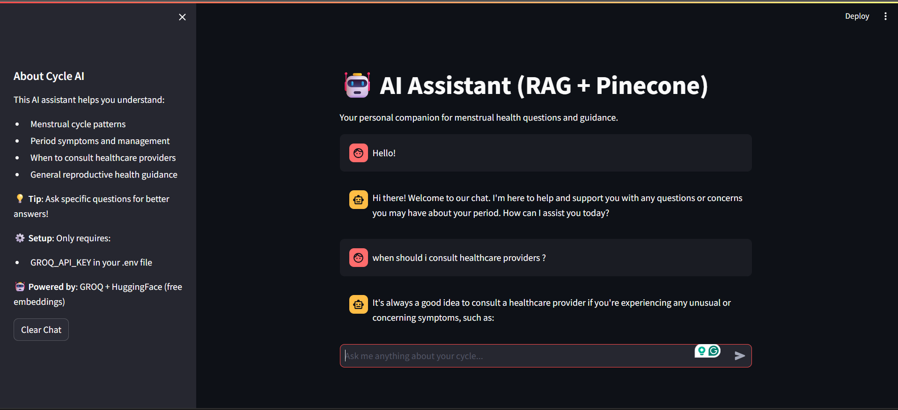

---


````markdown
# Cycle RAG - RAG API Backend

This repository contains the backend code for the Cycle RAG system — a Retrieval-Augmented Generation (RAG) application built using FastAPI. The system uses OpenAI APIs and local document embeddings to answer user queries based on uploaded data.

---

## 🚀 Features

- FastAPI-based backend
- OpenAI-powered RAG system
- ChromaDB for vector storage
- Sentence Transformers for embeddings
- Chat memory support
- Dockerized for easy deployment

---

## 📁 Directory Structure

```text
cycle_api/
├── main.py              # FastAPI application entry point
├── rag_utils.py         # RAG utility functions (embedding, retrieval, QA)
├── ingest.py            # Script to load and embed documents
├── .env                 # Environment variables (not included in repo)
├── all.txt              # Python dependencies list
├── Dockerfile           # Docker configuration
└── wheels/              # (Optional) Pre-downloaded wheels (not used in direct install)
````

---

## ⚙️ Setup Instructions

### 1. Clone the Repository

```bash
git clone https://github.com/Kyvra-Labs-Pvt-Ltd/Cycle_Rag.git
cd Cycle_Rag
```

### 2. Create and Activate a Virtual Environment (Recommended)

```bash
# Linux/macOS
python -m venv venv
source venv/bin/activate

# Windows
python -m venv venv
venv\Scripts\activate
```

### 3. Install Dependencies

```bash
pip install --upgrade pip
pip install -r all.txt
```

### 4. Add Environment Variables

Create a `.env` file in the root directory and add:

```env
OPENAI_API_KEY=your_openai_key
```

Replace `your_openai_key` with your actual OpenAI API key.

---

### 5. Run the Application

```bash
uvicorn main:app --host 0.0.0.0 --port 8000
```

### 6. Access the API

* Docs: [http://localhost:8000/docs](http://localhost:8000/docs)
* Root: [http://localhost:8000/](http://localhost:8000/)

---

## 🐳 Docker Instructions

### 1. Build the Docker Image

```bash
docker build -t cycle-rag-api .
```

### 2. Run the Docker Container

```bash
docker run -p 8000:8000 --env-file .env cycle-rag-api
```

> If port 8000 is in use, map to another port like:

```bash
docker run -p 8001:8000 --env-file .env cycle-rag-api
```

---

## 🧠 How It Works

1. The user sends a query to the API.
2. The backend retrieves relevant documents using ChromaDB.
3. OpenAI API generates a response based on the retrieved context.
4. Chat memory is optionally maintained per session.

---

## 📄 Example `.env` File

```env
CHROMA_URL=http://localhost:8000
GROQ_API_KEY=your_groq_key_here
```


```
